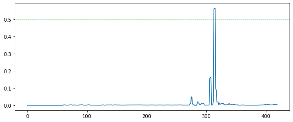
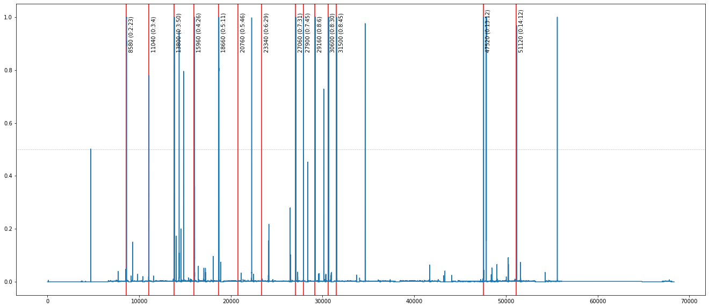
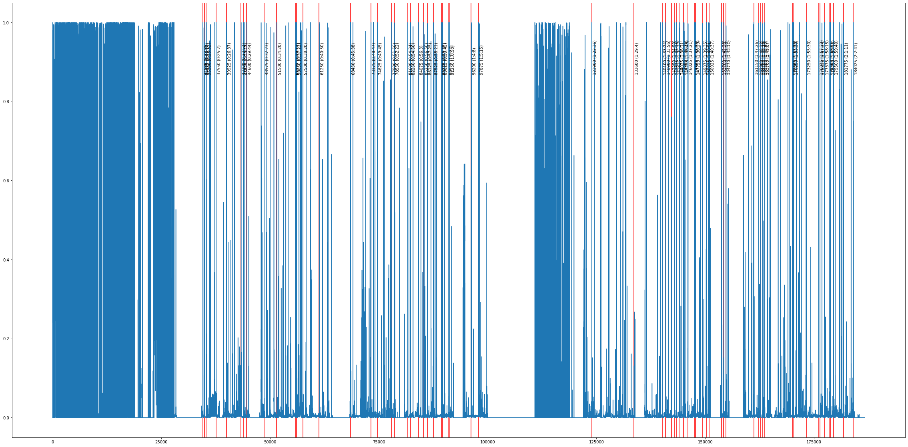

# Automated-Basketball-Highlights-with-Deep-Learning

The project involves producing a basketball game highlights movie utilizing yolov5 for detecting the basket and resnet50 for identifying scoring actions.

## Introduction
This project is **Machine Learning for Computer Vision project work** from the second year of the master's program Artificial Intelligence in Bologna done by **Davide Brescia**.
The final model will be able to:
*   **INPUT**: *video* of a basketball game
*   **OUTPUT**: *text file* in which there are written the minutes of the shoots on target made

Different approaches will be used to arrive at the best result, the following experiments can be found inside the notebook:

*   **[Part 1] Binary classification on 1280x720 images**: I used a dataset consisting of 430, 1280x720 screenshots of 83 basketball games with a *baseline model* and with *resnet50*. These screenshots are divided into *point* (when the ball is inside the basket or has noticeably deformed the retina) and *no-point* (all other cases).
*   **[Part 2] Binary classification on 128x128 and 1280x720 images**: I decided to perform a cropping of these screenshots (plus other 6000 images) obtaining 128x128 images showing only the basket.
*   **[Part 3] Basket Localization and binary classification on 128x128 images**: since the previous model was able to distinguish basket and non-basket in 128x128 images, it might be a good idea to give the previous model only cropped images. Unfortunately, however, as specified above, the images I use for work are 1280x720, so I decided to train yolov5's small model to locate the basket, crop it, and give it as input to the previous model.

## Results

### Test YoloV5+Resnet50 on a Tiny clip (~ 7s)

Before giving a 4Gb video, I thought it useful to go step by step. I therefore chose to use a 7-second clip with a `point` inside to get confirmation that `YoloV5` and `ResNet50` (Finetuned) were working properly. The point is between the 4th and 5th seconds of the clip. As can be seen from the graph, the model found the `point` correctly.

### Test YoloV5+Resnet50 on a portion of a Match (~ 20m)

I'll use this game (25 fps): **Monopoli - Roseto** (First Quarter), Italian Basketball Serie B, Giornata 15 [📊 [legapallacanestro](https://www.legapallacanestro.com/wp/match/ita3_d_2210/ita3_d/x2223)]

After seeing that on images individually the combination of YoloV5 + Resnet50 works correctly, it was time to perform a real test on a clip of a basketball game (the first quarter, around 20 minutes). I manually annotated the baskets in a .txt file and will compare the model results with them. Also since the points are in the range of tens, I thought it will be quicker to make findings on performance manually.

As we can see from the graph represented here, the model seems to have a decent performance, in particular:

* **True Positive**: 12
* **False Positive**: 8
* **True Negative**: 68334
* **False Negative**: 2

About metrics we have:

* **Recall**: 12/14 = 0.86
* **Precision**: 12/20 = 0.60
* **F1 Score** = 0.71

In addition, by better analyzing the video at the critical points (false positives and false negatives), I noticed (understandably) that:

* Usually the model misclassifies frames as `point` when the ball is near the basket or the net is deformed (e.g. by a missed shot)
* Typically, some three-pointers are very precise and the ball has a very fast trajectory that almost imperceptibly deforms the net, making the ball appear very distorted. Furthermore, there are fewer "attempts" to guess the basket because compared to other shots, the three-pointer is associated with fewer frames. For this reason, the model struggles to classify some three-pointers as `point`.

### Inference on Match video [1+ hour with GPU]
I chose this video for two main reasons:
* It does not feature the team I work for, so it is played on a different court than usual and I want to see how the model performs having seen few baskets from this court
* The cameraman for this game uses different zooms when a player makes a basket, so I would like to test the scale invariance of the model

I'll use this game (25 fps): **Bisceglie-Avellino**, Italian Basketball Serie B, Giornata 15 [📊 [legapallacanestro](https://www.legapallacanestro.com/wp/match/ita3_d_2217/ita3_d/x2223)]

While studying the results, I noticed how the model was anomalous in some parts of the movie (see graph below). I am talking about the early part of the match and the middle part. However in those instants the players usually shoot at the basket to warm up so that abnormal behavior is justified. I decided later to eliminate those parts so as not to modify the results.

Synthesizing the results:
* The model **found 451 total points** (Many of these during the warm-up). I was able to find the baskets by calculating the peaks on the graph below using `signal.find_peaks(frame_confidence, height=.5, distance = frame_tollerance)`. In other words, I wanted maximums of at least `0.5` (threshold) to be found and to have a distance between them of at least `frame_tollerance` (this is to prevent detection of the same basket multiple times).
* After eliminating hoop shots during hooping we were **left with only 146 points**.

But will they all be correctly detected points? Obviously not:
* Points found correctly (True Positive): 64
* Points not found (False Negative): 2
* Missclassified Points found (False Positive): 82

In terms of metrics we have (which coincide with the results of the previous test):
* Precision: 0.44
* Recall: 0.97
* F1 Score: 0.60

### Highlights

Final Result: [Youtube Video](https://youtu.be/WfsedD_gxaE)

The video is 17:04 long (7 second for predicted point) and contain some interesting choices

More info on the Python Script created for create Highlights given a video, minutes and ads here: [Highlights-Automation GitHub](https://github.com/isBre/Highlights-Automation)
## Final Consideration and Future Implementations
To conclude the project, I would like to report on the pros and cons of the following project:

**PROS**:
* **Excellent recall**; in fact, it could be useful as a tool to support the creation of highlights. I will then have to choose, from the baskets proposed by the model (about half of which are incorrect), which ones to include in the highlights.
* **Small Datasets but good performances**; although I did not initially have the dataset with the images to give to the model it was necessary to invest little time in creating a small dataset to get good results. In the future, using a larger and more diverse dataset could greatly increase the results obtained.

**CONS**:
* **Very poor computation performance**; the model takes more than an hour to make inference on a match of about two hours 1280x720. I tried using some tricks such as switching a model half the size to yolo, but that still did not do the trick. In the future it will be critical to focus on this part (perhaps optimizing the way frames are handled and parallelize as much as possible between GPUs)
* **Very bad points filtering**; another point to invest time in is to perform a filter on the baskets obtained from the model. As can also be seen from the highlights produced by the model many of the misclassified baskets are given by the fact that in perspective the ball is close to the basket (for example on throw-ins from the back when the ball is stationary for a long time). The model seems very confident in this area getting a suspiciously long sequence of spikes on the graph.
